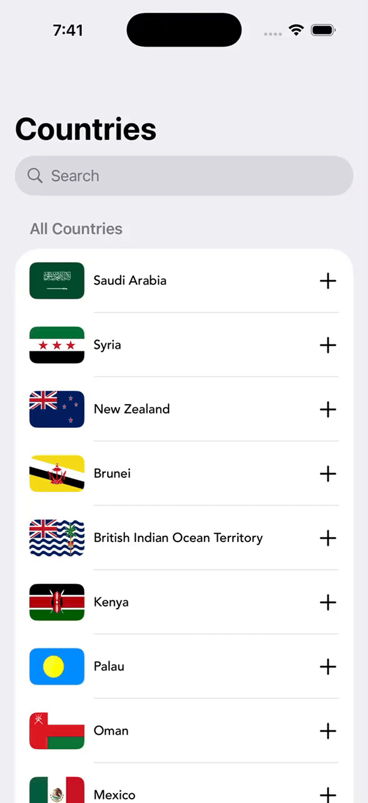

# 🇺🇳 Country App (SwiftUI)

A simple and elegant SwiftUI application that displays a list of countries with their flags. The app includes search functionality and a clean UI, making it ideal as a task, assignment, or learning project.

## 📱 Demo

## ✨ Features

## Library
Factory Library For Dependency Injection

- View a list of countries with their flags
- Real-time search functionality
- Add icon for optional actions
- Clean and modern SwiftUI interface
- Smooth scrolling and simple layout

## 🛠️ Tech Stack

- Swift
- SwiftUI
- Local JSON or static data

## 📂 Project Structure

CountryApp/
│── Models/
│── Views/
│── ViewModels/
│── Resources/
│── Assets/
└── CountryApp.swift

## 🚀 How to Run

1. Clone the repository
2. Open the project using Xcode
3. Make sure your Xcode version supports SwiftUI
4. Run the app on a simulator or physical device

## 🎯 Purpose

This project was created as a task to demonstrate:
- SwiftUI layout
- Rendering lists with images
- Search bar implementation
- Clean UI structure
